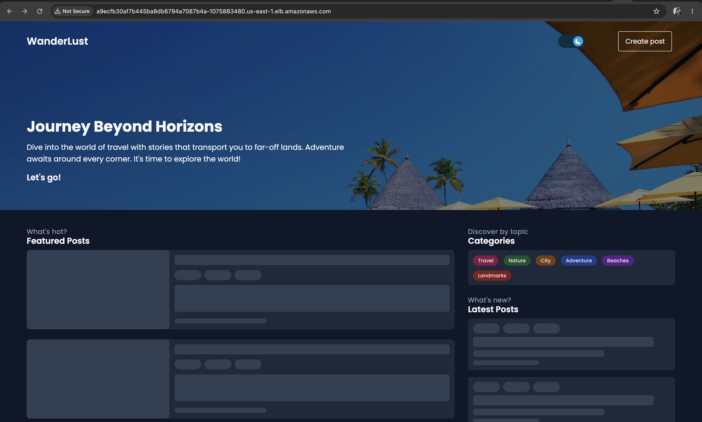
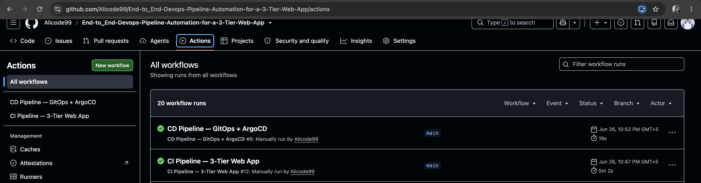
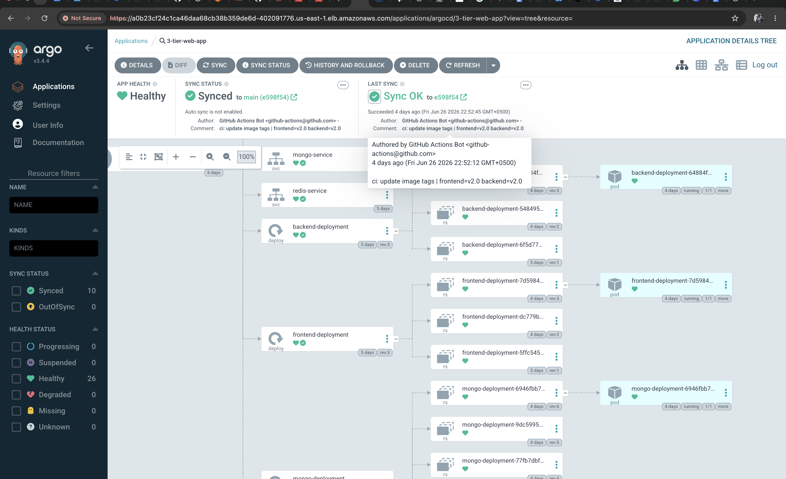
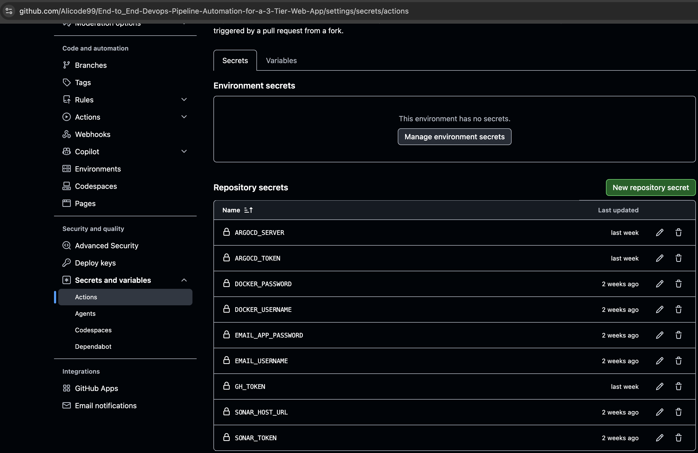

# End-to-End DevOps Pipeline Automation for a 3-Tier Web Application

A production-grade CI/CD pipeline  that automates the complete software delivery lifecycle — from code commit to live deployment on AWS EKS — using modern DevOps tools and GitOps principles.

---

## 🏗️ Architecture Overview

Developer pushes code

↓

GitHub Actions CI Pipeline

→ Trivy filesystem scan

→ OWASP dependency check

→ SonarQube code quality analysis

→ Docker image build (frontend + backend)

→ Push to DockerHub

↓

GitHub Actions CD Pipeline

→ Update Kubernetes manifests (image tags)

→ Push updated YAMLs to GitHub

↓

ArgoCD detects change

→ Auto-sync to AWS EKS cluster

↓

App live on AWS LoadBalancer ✅

---

## 🛠️ Tech Stack

| Category | Tools |
|---|---|
| **CI/CD** | GitHub Actions |
| **Security Scanning** | Trivy, OWASP Dependency Check, SonarQube |
| **Containerization** | Docker, DockerHub |
| **Orchestration** | Kubernetes (AWS EKS) |
| **GitOps / CD** | ArgoCD |
| **Infrastructure as Code** | Terraform |
| **Cloud** | AWS (EKS, EC2, EBS, IAM, LoadBalancer, VPC) |
| **Frontend** | React (Vite) + Nginx |
| **Backend** | Node.js |
| **Database** | MongoDB (with EBS persistent storage) |
| **Cache** | Redis |

---

## 📸 Screenshots

### Live Application


### CI/CD Pipeline — GitHub Actions


### ArgoCD — Synced Deployment on EKS


### Secured Secrets Management


---

## 📁 Project Structure

├── .github/

│   └── workflows/

│       ├── ci.yml          # CI Pipeline — build, scan, push

│       └── cd.yml          # CD Pipeline — manifest update, ArgoCD sync

├── frontend/                # React application

├── backend/                 # Node.js API

├── kubernetes/               # K8s manifests

│   ├── backend.yaml

│   ├── frontend.yaml

│   ├── mongodb.yaml

│   ├── redis.yaml

│   ├── persistentVolume.yaml

│   └── persistentVolumeClaim.yaml

├── terraform/                # AWS EKS infrastructure

│   ├── eks.tf

│   ├── vpc.tf

│   └── provider.tf

└── Automations/               # Environment setup scripts

---

## ⚙️ CI Pipeline (ci.yml)

Triggered manually via `workflow_dispatch` with Docker image tags as inputs.

**Stages:**
1. **Validate** — Ensure Docker tags are provided
2. **Trivy Scan** — Filesystem vulnerability scan
3. **OWASP Check** — Dependency vulnerability check
4. **SonarQube Analysis** — Code quality + quality gate
5. **Docker Build** — Build frontend and backend images
6. **DockerHub Push** — Push images with version tags
7. **Trigger CD** — Automatically trigger cd.yml with same tags

---

## 🚀 CD Pipeline (cd.yml)

Triggered automatically by the CI pipeline on success.

**Stages:**
1. **Checkout** repo with write permissions (GH_TOKEN)
2. **Verify** image tags received from CI
3. **Update manifests** — `sed` replaces image tags in K8s YAMLs
4. **Git push** — Updated YAMLs pushed to GitHub
5. **ArgoCD sync** — Detects change, deploys to EKS automatically
6. **Email notification** — Success/failure email sent

---

## 🏗️ Infrastructure (Terraform)

AWS EKS cluster provisioned using Terraform:

```bash
cd terraform
terraform init
terraform plan
terraform apply
```

**Resources created:**
- VPC with public subnets
- EKS Cluster
- Worker Node Group (t3.small × 2)
- IAM Roles (cluster + node group + EBS CSI)
- EBS CSI Driver addon for persistent MongoDB storage

---

## ☸️ Kubernetes Setup

**Namespaces:**
```bash
kubectl create namespace wanderlust
kubectl create namespace argocd
```

**ArgoCD Install:**
```bash
kubectl apply -n argocd -f https://raw.githubusercontent.com/argoproj/argo-cd/stable/manifests/install.yaml
kubectl patch svc argocd-server -n argocd -p '{"spec": {"type": "LoadBalancer"}}'
```

**ArgoCD App Config:**

App Name:     3-tier-web-app

Repo URL:     https://github.com/Alicode99/End-to_End-Devops-Pipeline-Automation-for-a-3-Tier-Web-App

Path:         kubernetes

Namespace:    wanderlust

Sync Policy:  Manual

---

## 🔐 GitHub Secrets Required

| Secret | Purpose |
|---|---|
| `DOCKER_USERNAME` | DockerHub login |
| `DOCKER_PASSWORD` | DockerHub login |
| `SONAR_TOKEN` | SonarCloud authentication |
| `SONAR_HOST_URL` | SonarCloud URL |
| `GH_TOKEN` | GitHub PAT for manifest push |
| `ARGOCD_SERVER` | ArgoCD LoadBalancer URL |
| `ARGOCD_TOKEN` | ArgoCD API token |
| `EMAIL_USERNAME` | Gmail for notifications |
| `EMAIL_APP_PASSWORD` | Gmail App Password |

---

## 🚦 How to Run the Pipeline

1. Go to **GitHub → Actions → CI Pipeline — 3-Tier Web App**
2. Click **Run workflow**
3. Enter:

FRONTEND_DOCKER_TAG: v1.0.0

BACKEND_DOCKER_TAG:  v1.0.0

4. Pipeline runs automatically — CD triggers on success
5. ArgoCD syncs to EKS
6. App accessible via AWS LoadBalancer URL

---

## 🐛 Key Challenges Solved

- **EBS CSI Driver** — Installed and configured IAM role for persistent MongoDB storage on EKS
- **MongoDB lock conflict** — Resolved `mongod.lock` issue caused by multiple pods accessing the same PVC
- **PV/PVC binding** — Fixed PersistentVolume format from deprecated `awsElasticBlockStore` to CSI format
- **Frontend build-time env injection** — Configured `VITE_API_PATH` as a Docker build argument for the production nginx build
- **ArgoCD namespace** — Created the `wanderlust` namespace before ArgoCD sync

---

## 👨‍💻 Author

**Ali Raza**
BS Information Technology — UMT Lahore (2026)

- GitHub: [Alicode99](https://github.com/Alicode99)
- LinkedIn: [Ali Raza](https://www.linkedin.com/in/ali-raza-4701a7267/)
- Email: alirazaakram35@gmail.com
